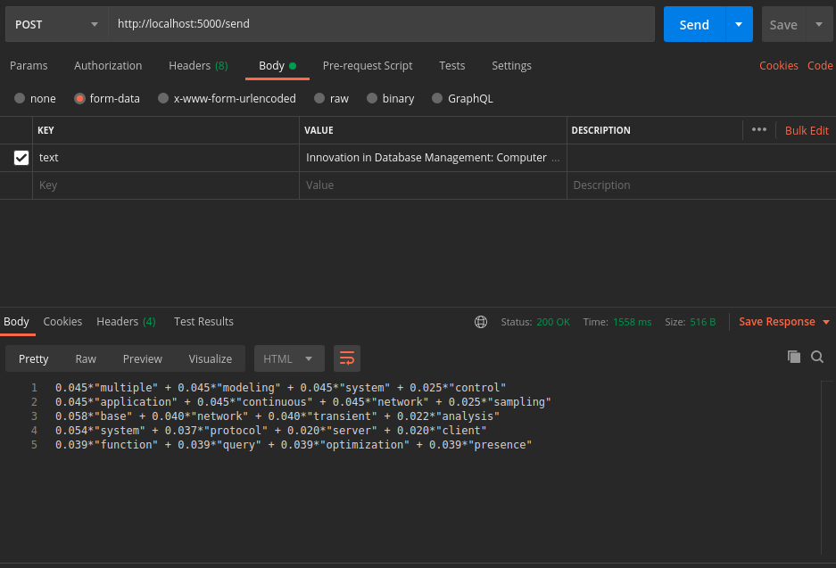

# Topic Modeling API

## How to run

Install necessary dependencies, make sure that you have Python 3 installed. Use the `requirements.txt` to install the necessary dependencies, it is recommendable to use a virtual enviroment.
To initialize flask app run the following commands:
```bash
export FLASK_APP=main.py
flask run
```
Afterwards, send a `POST` request to the `http://localhost:5000/send` with body the following body template:
```json
{
	"text": "Text to be analized"
}
```

## Example

